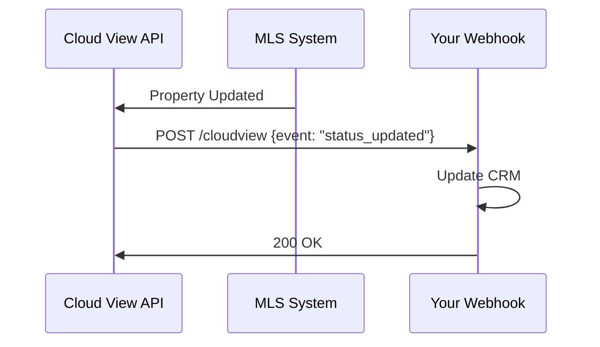

## Overview

Cloud View Productions integrates seamlessly with popular real estate platforms to enhance your marketing workflow. Sync property data from MLS systems, receive real-time updates via webhooks, embed interactive tours on listing sites, and push analytics to your CRM. These connections help you sell homes faster by keeping data current across tools.

<Columns cols={3}>
  <Card title="MLS Sync" icon="database" href="#mls-sync">
    Automatically pull listing data into your tours.
  </Card>
  <Card title="Webhooks" icon="zap" href="#webhooks">
    Get instant notifications on property status changes.
  </Card>
  <Card title="Embed Tours" icon="globe" href="#embedding">
    Add 360° tours to Zillow, Realtor.com, or your site.
  </Card>
</Columns>

## MLS Data Sync

Connect to Multiple Listing Service (MLS) providers to import property details like photos, descriptions, and pricing directly into your Cloud View Productions tours.

<Tabs>
  <Tab title="RETS/IDX" icon="network">
    Use RETS protocol for IDX feeds.
    
    <Steps>
      <Step title="Get Credentials">
        Obtain RETS username, password, and server URL from your MLS provider.
      </Step>
      <Step title="Configure Sync">
        In your dashboard at `https://dashboard.example.com/integrations/mls`, enter credentials.
      </Step>
      <Step title="Map Fields">
        Match MLS fields to tour properties (e.g., `ListPrice` to `price`).
      </Step>
    </Steps>
  </Tab>
  <Tab title="RESO Web API" icon="api">
    Modern API-based sync for RESO-compliant MLS.
    
    <Callout kind="tip">
      RESO supports OAuth 2.0 for secure access.
    </Callout>

    ```javascript
    const response = await fetch('https://api.mlsprovider.com/listings', {
      headers: {
        'Authorization': 'Bearer YOUR_MLS_TOKEN'
      }
    });
    ```
  </Tab>
</Tabs>

## Webhooks for Real-Time Updates

Set up webhooks to receive instant notifications when property status changes, new media uploads, or tours go live. Point your endpoint to `https://your-webhook-url.com/cloudview`.

<CodeGroup tabs="Node.js,Python">
  ```javascript
  const express = require('express');
  const app = express();
  app.use(express.json());

  app.post('/cloudview', (req, res) => {
    const { event, propertyId, status } = req.body;
    if (event === 'status_updated') {
      console.log(`Property ${propertyId} now ${status}`);
    }
    res.status(200).send('OK');
  });

  app.listen(3000);
  ```
  ```python
  from flask import Flask, request, jsonify
  app = Flask(__name__)

  @app.route('/cloudview', methods=['POST'])
  def webhook():
      data = request.json
      event = data['event']
      property_id = data['propertyId']
      status = data['status']
      if event == 'status_updated':
          print(f"Property {property_id} now {status}")
      return jsonify({'status': 'OK'}), 200

  if __name__ == '__main__':
      app.run(port=3000)
  ```
</CodeGroup>



<Callout kind="alert">
  Always validate webhook signatures using the `X-CVP-Signature` header to prevent spoofing.
</Callout>

## Embedding Tours on External Sites

Embed your 360° tours directly into real estate portals or client websites using simple iframe code.

<Expandable title="Advanced Embedding Options" default-open="false">
  Customize size, autoplay, and analytics tracking.
  
  ```html
  <iframe
    src="https://tours.example.com/embed/{tourId}?autoplay=true&theme=dark"
    width="100%"
    height="500"
    frameborder="0"
    allowfullscreen>
  </iframe>
  ```
</Expandable>

## CRM Analytics Integration

Push tour views, engagement metrics, and lead data to CRMs like Salesforce or HubSpot.

```javascript highlight="2-5"
const analyticsData = {
  propertyId: "12345",
  views: 150,
  avgTime: "2m 30s",
  leadsGenerated: 3
};

fetch('https://api.hubspot.com/analytics/v1/events', {
  method: 'POST',
  headers: { 'Authorization': 'Bearer YOUR_HUBSPOT_TOKEN' },
  body: JSON.stringify(analyticsData)
});
```

<Columns cols={2}>
  <Card title="Next: Quickstart" icon="rocket" href="/quickstart">
    Set up your first tour.
  </Card>
  <Card title="API Reference" icon="code" href="/authentication">
    Full API details.
  </Card>
</Columns>